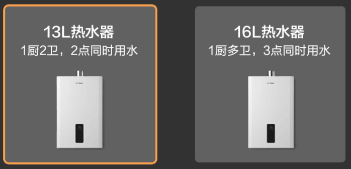
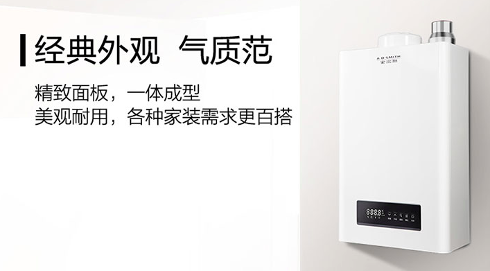

电器类
========

燃气热水器
------------

收楼后要安装的第一个电器，我觉得应该是热水器，因为有了它，你就拥有一个 24 小时热水的家。未来城小区预先安装了天然气管道，并在房屋内预留了热水器接口，因此我们只需要选购并安装燃气热水器，即可享受温暖！

选购燃气热水器，最关键的指标是容量。但与储水式电热水器不同，燃气热水器很难从升数上看出适合多少人用。一方面是因为升数衡量的是单位时间的出水量，另一方面是因为一个燃气热水器可同时为沐浴、厨房、洗手台提供热水。

一般来说，两口之家、一个卫生间选择 10-13L 的燃气热水器；家里有 3-6 人或两个卫生间的家庭，建议选择 12L-16L 的燃气热水器； 四世同堂的大家庭或浴室带有浴缸，建议选择 16L 以上的燃气热水器。

小编推荐几款，供大家参考：

**美的燃气热水器 家用天然气12升智能平衡机**

即开即热/可装浴室专用安全防护/防CO泄漏/12HC5

.. figure:: images/Midea_12HC5.png
   :align: center

.. rst-class:: center
.. rst-class:: index_links

    `优惠券链接 <https://union-click.jd.com/jdc?e=&p=AyIGZRhfEAMUAlMSWB0yEQNTHl4dAxUFURtrUV1KWQorAlBHU0VeBUVOWk1RAk8ECllHGAdFBwtaV1MJBAJQXk8JF0EfGQEWAVAeUxQFEANVDBsZdhBjMW8oYl1mbj17L3ZhRXAKczJ2YUdbNmkvcXZhe11sOWlSZmRVXjtsZnVkDGwcYnBmbiF4CRB2EGcNbyh2XmVYMX8idmFFYB18JHV2YkUCTTBecVt7U3tZR2RrdDUcLXx%2Be3M2b152e0t0LHgzE3YQYzFiP2kHZQUIbCxxdVJ%2FLEk7YUttRiEZI3F2cGdBGS4leHJCNE0ZRll3Yy9mBAtmTV8BcA9SYh4LZRprFQMTBVAbXxAAFDdlG1wlQ3wBUh1bHQYiBmUbXBQFFg5VHFMUBxMDZRxbHDJPQwdBE0BSUVUdK2slASI3ZRtYJQEiRTtJDxwAEw5QH1sdBBsCVU5SRVAbBQJOXhBRGlJcEwlAUCIFVBpfHA%3D%3D>`_ ·
    `商品链接 <https://union-click.jd.com/jdc?e=&p=AyIGZRhfEAMUAlMSWB0yEQNTHl4dAxUFURtrUV1KWQorAlBHU0VeBUVNR0ZbSkdETlcNVQtHRVNSUVNLXANBRA1XB14DS10cQQVYD21XHgRRHV4QChMAVx9bJXhscyhiRRNVd3AdaAMXdGB8V1sNdFQeC2UaaxUDEwVQG18QABQ3ZRtcJUN8AVIdWx0GIgZlG1wUBRYOVRxTFAAVAmUcWxwyT0MHQRNAUlFVHStrJQEiN2UbaxYyUGkHT1IXAxsCURtTEwsXBwASC0cLEFAAHl5GCkcOXUkORzIQBlQfUg%3D%3D>`_ 

**方太（FOTILE）13升燃气热水器 JSQ25-D13E1**

恒温/高层抗风/智能恒温/速热/多人

.. rst-class:: center
.. rst-class:: index_links

    `优惠券链接 <https://union-click.jd.com/jdc?e=&p=AyIGZRhfEAUQBlwbWBIyFQ9SE18WARIPVhNrUV1KWQorAlBHU0VeBUVOWk1RAk8ECllHGAdFBwtaV1MJBAJQXk8JF0EfGQUaAF0fWBYCGgRdDBsZdRBdMmI4ZkBmBSFLLExLRXA3Yz9icXYAIhkJfHZmdBBsOWJwZWMAXztNfnBkVGgZYUpyZSJvMxN1EHsNbyhARWR%2BLX4sXHVFYB18JHV2YkUCTTBecVt%2FXG85anByXSJZOGd5YHAMb1xiXWpUNW8oUGJafwZsOG5cZH4leThcUAYEImMiR2tlZCJaLBdye343e08XdyJXF3MBdkMUdTBQC0dDZlMpQDIUUhpnWRdrFDISBlQZXhUGFwVTK2sVBSJGOxtaFwQSAlAbaxQyEgBUHF8cAhoCUxNbEjIVB1wrBlFQSE8ASxhHSiI3ZRhrJTISBGUYa1dsQFNcGVocBxYHXR1SEAJHDgVJUhdVRwJQSFNACxpVAElrFwMTA1w%3D>`_ ·
    `商品链接 <https://union-click.jd.com/jdc?e=&p=AyIGZRhfEAUQBlwbWBIyFQ9SE18WARIPVhNrUV1KWQorAlBHU0VeBUVNR0ZbSkdETlcNVQtHRVNSUVNLXANBRA1XB14DS10cQQVYD21XHgBdHFMRAREHXRhTJUVIRwxHBGllcQ4dZQwTdEZuNU8gF3IeC2UaaxUDEwVQG18QABQ3ZRtcJUN8B1QZXRUHFwdlGmsVBRMAURJbHQcUDlwZaxICGzcIXwlPSkdXFkkTJTIiBGUraxUyETcXdQlBCxAGXB5fFQoUDlAbDhxSQA5XTA4QB0EPABJTR1dAN1caWhEL>`_ 

**海尔（Haier）16升强排式燃气热水器 JSQ31**

家用/天然气/水气双调/恒温/即热/零冷水/WIFI智控/多点供水

.. figure:: images/Haier_JSQ31.png
   :align: center

.. rst-class:: center
.. rst-class:: index_links

    `优惠券链接 <https://union-click.jd.com/jdc?e=&p=AyIGZRhfEAQWBlcSXB0yFQ5XHVwSChICVRNrUV1KWQorAlBHU0VeBUVOWk1RAk8ECllHGAdFBwtaV1MJBAJQXk8JF0EfGQUbBVMcXB0CFwddDBsZdRBRNW8SalxkfiFyLHZLRXEseCxhA2VAI2kzdXVLZ1BsMnJ7ZXMAWi98fnFwVGtSYXtEVCFoHRN0a3sNbyhARWR%2BA3ssTAJFYB18JHV2YkUCTTBecRNzU28ifntlcykdLxd2cmcMbBxhXUBUIhowUmFgbzx4Em0HZX4tfyx2Zhp%2FLEk7bHF5WyNyM3d1cGdBGS4lcHZMCEgDRnJxfh1CB2gCV3I1UF1nVB4LZRprFQMTBVAbXxAAFDdlG1wlQ3wHVBlaHAQTDmUaaxUFEwBRElgWARYDXBJrEgIbNwhfCU9KR1cWSRMlMiIEZStrFQEiBGVZNUdWGwVUEl4RAhoBXB5bQAtCVVwZDEAHF1RdTlIdUEdVZRlaFAYb>`_ ·
    `商品链接 <https://union-click.jd.com/jdc?e=&p=AyIGZRhfEAQWBlcSXB0yFQ5XHVwSChICVRNrUV1KWQorAlBHU0VeBUVNR0ZbSkdETlcNVQtHRVNSUVNLXANBRA1XB14DS10cQQVYD21XHgBcGV0SBRoHUBtTJXtXBA9zWlECckYjYT0PAlZlXH9aXWIeC2UaaxUDEwVQG18QABQ3ZRtcJUN8B1QZWhwEEw5lGmsVBRMAURJYFgEWA1IbaxICGzcIXwlPSkdXFkkTJTIiBGUraxUyETcXdQlBCxAGXB5fFQoUDlAbDhxSQA5XTA4QB0EPABJTR1dAN1caWhEL>`_ 

**万和(Vanward)16升零冷水燃气热水器**

水气双调/一级能效/冷凝式/增压/JSLQ27-LS5W16

.. figure:: images/Vanward_LS5W16.png
   :align: center

.. rst-class:: center
.. rst-class:: index_links

    `优惠券链接 <https://union-click.jd.com/jdc?e=&p=AyIGZRtfEwEUA1YcWhEyEgZUGloTABQGXR1dJUZNXwtEa0xHV0YXEEULWUpYA0wPSh1JUkpJBUkcSkIBR0RMR05aW1kBUQ4SBlQaWhMAFAZdHV0CQh5zLGs%2BYnF1RiFECXB7cXwUYyJPZXJjJlkvd31lcw9oHmN7cmIheCcBAWVnV04oYlhHRDVEDXV7dnQSeFltZWlkIl8sF1B3cBxSGm1yeUwBUixXZFpzMGI4QFVlWDF7LFxXU3NXazxuYgYFIA9ZYDJaRSFBHmNLcGUnaVoTQ0Z6UWMpFGdiC1krWiUCEwZXHlsRBxABZStbEjJEaVUaWhQDEwZdH1olAyIHUhpcEQsTBVIZXBUCIgBVEmtIRkBdHU4LVlBaN2UrWCUyIgdWK1glQHxVARJZFAsXA1UTXRwHElJcSwkcAEVSUB4IHVcbDwdOCSUAEwZREg%3D%3D>`_ ·
    `商品链接 <https://union-click.jd.com/jdc?e=&p=AyIGZRtfEwEUA1YcWhEyEgZUGloTABQGXR1dJUZNXwtEa0xHV0YXEEULWldTCQQHCllHGAdFBwtEQkQBBRxNVlQYBUkeTVxNCRNLGEF6RwtVGloUAxQFUxpTEwQiHRNAIlVDbXAweQtCfnoECk5Sfn8MQVkXaxQyEgZUGV4VBhcFUytrFQUiUTsbWhQDEwZUE18UMhM3VRxaEgYbBlccWRELFjdSG1IlX1ZVD1MORUFAT2UraxYyIjdVK1glQHxVARJZFAsXA1UTXRwHElJcSwkcAEVSUB4IHVcbDwdOCSUAEwZREg%3D%3D>`_ 

**史密斯（A.O.Smith）13升燃气热水器**

家用/双温度传感器/智能恒温/大屏设计/防冻/JSQ26-J0

.. rst-class:: center
.. rst-class:: index_links

    `商品链接 <https://union-click.jd.com/jdc?e=&p=AyIGZRprFQMTBlQdXRcBGgVcKx9KWkxYZUIeUENQDEsFA1BWThgJBABAHUBZCQUdRUFGGRJDD1MdQlUQQwVKDFRXFk8jQA4SBlQaWhMEEARdGVIlWnoEIkcZQ15ydVITBEtZZV9QfwtJVB4LZRprFQMTBVAbXxAAFDdlG1wlVHwHVBpaFAMSBl0SaxQyEgBUHF8cAhAGUB9bFTIVB1wrBlFQSE8ASxhHSiI3ZRhrJTISN1YrGXtQRg5XGlIQBhIPUxJeFVcbVwcSWUJXFwIGEw4cCkBSBytZFAMWDg%3D%3D>`_ 

