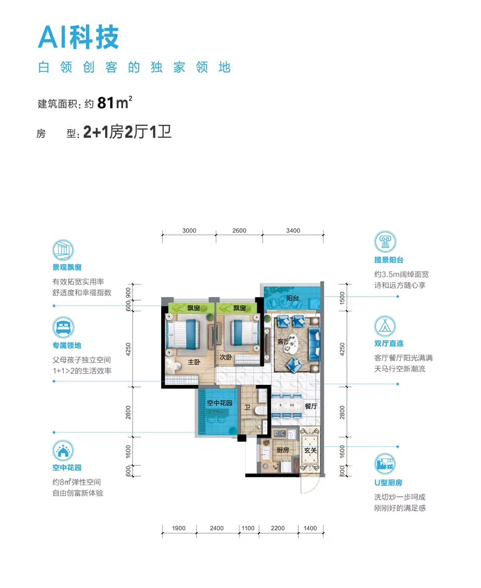
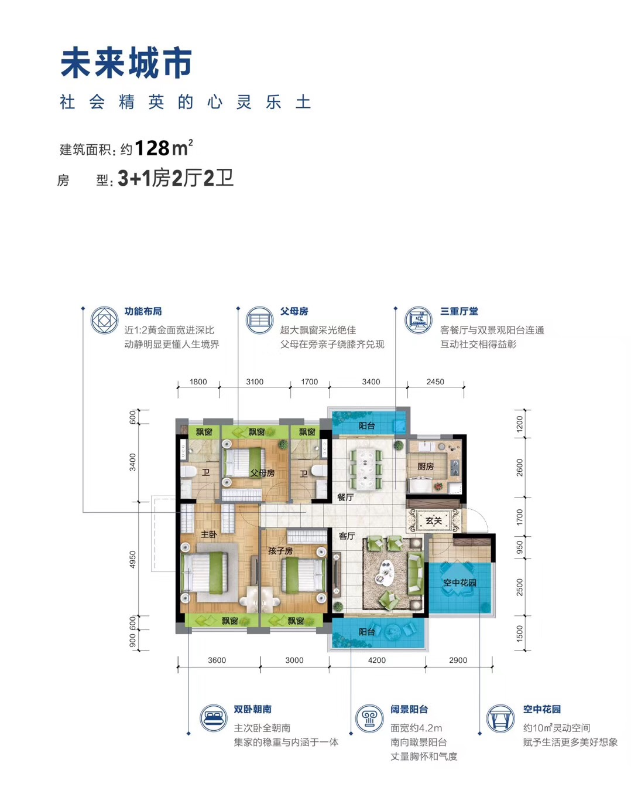
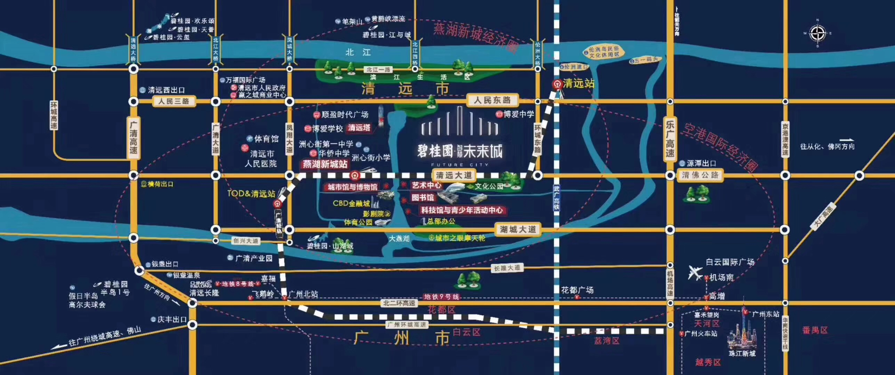

# 小区介绍

清远碧桂园智慧未来城位于清城区清远市清城区人民东路151号，主力户型为81平-225平2居-5居，共 2308 户。绿化率 33.84%。容积率 2.9。

## 户型

未来城主要有三种户型，建筑面积分别为 81、96、128 m^2^，另外还有中间两栋 225 m^2^ 的大户型。

**户型1**（01、02 单位）

**户型2**（04、05 单位）

**户型3**（03、06 单位）

---

## 燕湖新城

