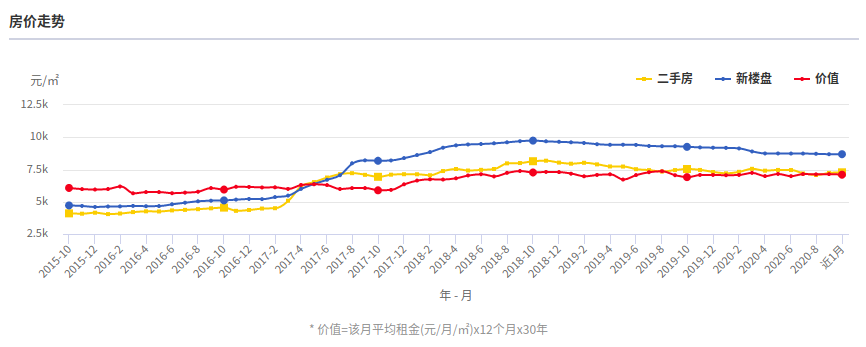

# 房价

## 房价跟踪

| 时间   | 未来城均价 | 清城区均价 |
| ------ | ------ | ------ |
| 2019年 | ￥9500 | ￥8112 |
| 2020年 | ￥8500 | ￥7501 |
| 2021年 |        |        |
| 2022年 |        |        |

## 房价走势

数据来源：中国房价行情网