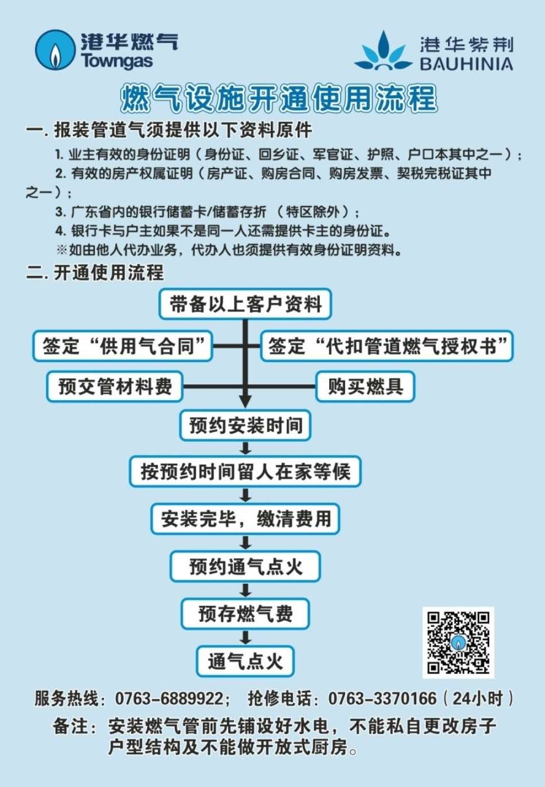

# 常见问题

## 更换门锁密码

- 推开智能门锁后盖（不用螺丝刀）；
- 按下下方的设置按钮，听到提示音后输入管理员密码（初始管理员密码是 `111122`，如果不是请联系物业），按 `#` 号结束；
- 密码登记请按 `1`，卡登记请按 `2` ...... 根据提示操作即可。

温馨提示：建议先删除所有密码，重新设置密码以及管理员密码。（记得保管好密码哦！）

---

## 燃气报装流程

关注“清远港华燃气”公众号，或电话预约（0763-6889922）。

**经验分享**

只需带上业主身份证、房产证明（建议提前打印复印件）到港华燃气营业厅登记即可。（可自愿购买民用燃气综合保险）

> 地址：清远市新北江二路金洲花园首层。

预约点火前必须安装好炉具和热水器，热水器可在港华燃气营业厅购买。

完成登记后续流程：

1. 七个工作日上门安装燃气表；
2. 到物业领取连接炉、热2条波纹管；
3. 安装好热水器请提前三个工作日预约开通点火；
4. 开通后请在「清远港华燃气」微信公众号充值燃气费；

