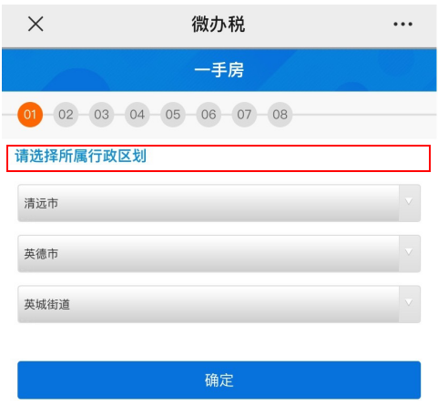
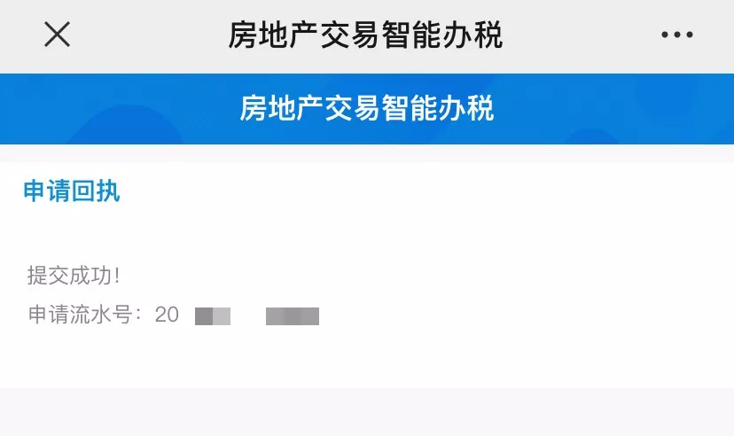
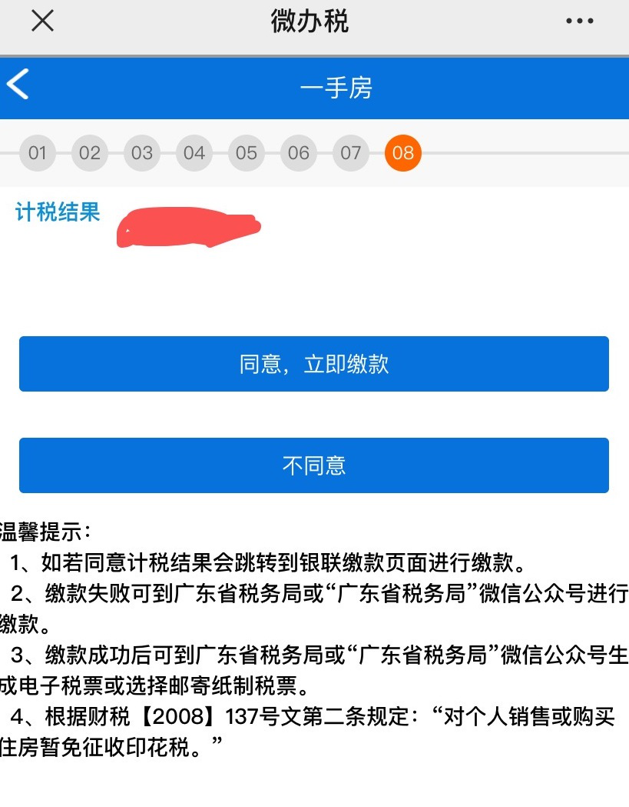

# 收楼事宜

## 房屋验收安排

**9、10、11 栋验收时间表**

| 序号   | 楼栋   | 预验收时间 |
| ------ | ------ | ------ |
| 1 | 新城之光碧桂园11栋 | 2020年10月17日-10月18日   |
| 2 | 新城之光碧桂园10栋 | 2020年10月23日-10月25日 |
| 3 | 新城之光碧桂园9栋 | 2020年10月23日-10月25日 |

备注：分批次交付，业主请提前安排预约到访时间。

---

## 收楼程序指引

**销售中心收楼手续**

- 请您提前与跟办销售顾问联系，了解所需带备的资料及费用。
- 到达销售中心后，在跟办销售顾问指引下到缴款处刷卡缴款，并凭所有楼款收据换取发票。
- 在跟办销售顾问指引下提供相关收楼、办证资料，签署收楼、办证文件；领取《收楼通知书》、《碧桂园物业及资料移交书》及经收款人员确认的《收楼费用确认表》后，完成销售中心的收楼手续。
- 凭《收楼通知书》、《碧桂园物业及资料移交书》、《收楼费用确认书》前往物业服务中心继续办理手续。

 

**物业服务中心收楼手续**

- 凭业主身份证、《收楼通知书》、《碧桂园物业及资料移交书》、《收楼费用确认书》，确认身份。
- 办理收楼手续，填写并签署各项文件。
- 办理业主/住户IC卡、临时住户证、家庭助理卡等出入卡。
- 由工程助理陪同，对您所购的楼宇进行验证，并在《房屋验收记录表》上签名确认。

 

温馨提示：
1. 需提前准备任意1张中国银行、中国建设银行、中国农业银行、中国工商银行储蓄卡办理银行划扣物业服务费或代收水电费；
2. 请妥善保管您的所购房发票、收据及所购单位的全套钥匙。

下载[《新房收楼秘籍》](../_static/新房收楼秘籍(已留出空白).xls)

---

## 缴纳契税指引

收楼后，可以在“清远税务”微信公众号预约缴税。

**参考步骤：**

1. 关注“清远税务”微信公众号，实名认证后，点击“微办税”—“房地产交易智能办税”，选择“增量房”（住宅及非住宅），如下图。
   
2. 选择不动产所属行政区划，点击“确认”，如下图。
   
3. 进入阅读办理须知界面，纳税人阅读相关办理须知后，点击“已经阅读，确认办理”，进入下一步填写购房人信息，如下图。
   
   在“填写购房人信息”界面，纳税人可选择自行申报或代理申报。若选择自行申报，填写购房人信息和办理人联系电话，点击获取验证码，待收到验证码后填写验证码，点击“下一步”，如下图。
   
4. 进入“房产信息查询”界面，输入房屋买卖合同编号（纸质合同封面页右上角的“合同编号”），点击“查询”，如下图。
   
5. 系统根据纳税人提供的房屋买卖合同编号自动获取房产相关信息，点击“确认”弹出的提示界面，纳税人补充完整剩下的未填写栏目，其中标红“*”号为必填项，核对合同信息，如下图。
   
6. 进入卖方信息、不动产项目信息和买方信息界面，填写标红“*”号栏目，如下图。
   
   点击买方信息的“编辑”，如实填写买方相关信息，标红“*”号为必填项，如下图。
   
7. 进入选择是否提供补充信息界面，纳税人选择是否按照业主名称分别开具税票，（如选是，如有多名纳税人，税票分别开具；如选否，则只根据一名纳税人开具税票），如下图。
   
8. 按照系统提示上传资料，点击“＋”号选择照片或者即时拍摄资料上传即可，如下图。
   
   注：按照相关规定，请您在本栏目一并上传购房发票。
   
   资料提交成功后，会收到系统派发的申请流水号。
9. 缴纳税款。对于无需审核的事项申请，纳税人同意计税结果后，可以直接进行税款的清缴。点击“同意，立即缴款”，进入银联缴款页面，纳税人正常操作即可扣款。
    
    如果您申请了税收优惠减免，请您耐心等待税务部门的短信提醒通知，并在收到审核通过的通知三天内完成网上缴交税费。
10. 税票打印。纳税人清缴相关税费后，可以对完税证明进行查询打印。进入房地产交易智能办税系统，点击“票证打印”按钮进入打印页面，系统自动查询纳税人关于增量房相关完税证明。
    

温馨提示：记得下载完税证明，联系律所工作人员登记办理房屋产权证。