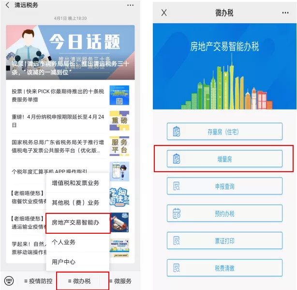

缴纳契税
===================

收楼后，可以在“清远税务”微信公众号预约缴税。

实名认证后，点击“微办税”—“房地产交易智能办税”，选择“增量房”（住宅及非住宅），如下图。

**参考步骤：**

（1）选择不动产所属行政区划，点击“确认”。

（2）进入阅读办理须知界面，纳税人阅读相关办理须知后，点击“已经阅读，确认办理”，进入下一步填写购房人信息。在“填写购房人信息”界面，纳税人可选择自行申报或代理申报。若选择自行申报，填写购房人信息和办理人联系电话，点击获取验证码，待收到验证码后填写验证码，点击“下一步”。

（3）进入“房产信息查询”界面，输入房屋买卖合同编号（纸质合同封面页右上角的“合同编号”），点击“查询”。

（4）系统根据纳税人提供的房屋买卖合同编号自动获取房产相关信息，点击“确认”弹出的提示界面，纳税人补充完整剩下的未填写栏目，其中标红“`*`”号为必填项，核对合同信息。

（5）进入卖方信息、不动产项目信息和买方信息界面，填写标红“`*`”号栏目。点击买方信息的“编辑”，如实填写买方相关信息，标红“`*`”号为必填项。

（6）进入选择是否提供补充信息界面，纳税人选择是否按照业主名称分别开具税票，（如选是，如有多名纳税人，税票分别开具；如选否，则只根据一名纳税人开具税票）。

（7）按照系统提示上传资料，点击“＋”号选择照片或者即时拍摄资料上传即可。（注：按照相关规定，请您在本栏目一并上传购房发票。）资料提交成功后，会收到系统派发的申请流水号。

（8）缴纳税款。对于无需审核的事项申请，纳税人同意计税结果后，可以直接进行税款的清缴。点击“同意，立即缴款”，进入银联缴款页面，纳税人正常操作即可扣款。（如果您申请了税收优惠减免，请您耐心等待税务部门的短信提醒通知，并在收到审核通过的通知三天内完成网上缴交税费。）

（9）税票打印。纳税人清缴相关税费后，可以对完税证明进行查询打印。进入房地产交易智能办税系统，点击“票证打印”按钮进入打印页面，系统自动查询纳税人关于增量房相关完税证明。

----

|:heart:| 温馨提示：记得下载完税证明，联系律所工作人员登记办理房屋产权证。