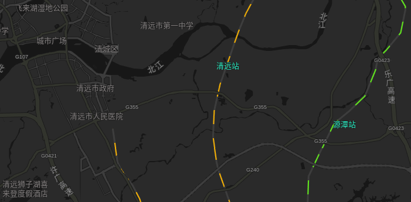
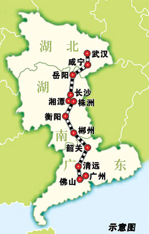
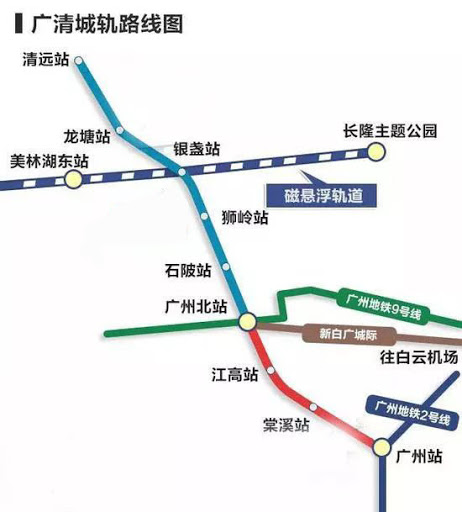

# 铁路

清远的铁路轨道交通主要有三条线：

- 京广铁路（北京通往广州的铁路，全长2284公里），途径源潭站；
- 武广高铁（武汉通往广州的高铁，全长1068公里），途径清远站；
- 广清城轨（未开通）

## 武广高铁

武广高铁已于2009年开通运营，设计时速350公里/小时。未来城距离清远站约4公里，20分钟即可到达广州南站。

---

## 广清城轨

广清城际铁路一期工程（广州北站至清远站段）于2012年11月22日动工建设，一期总长38.2千米，共设6座车站，设计时速200公里/小时，预计2020年底开通运营。

