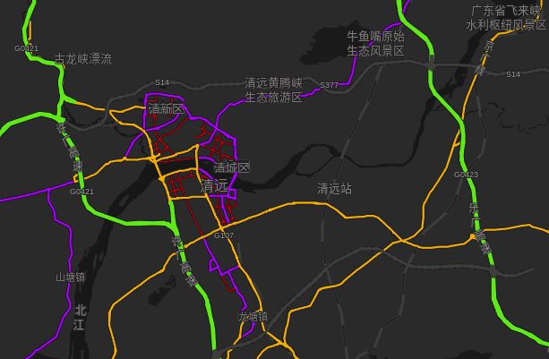

# 自驾

南北走向贯穿清远市的一条高速公路是许广高速（许昌-广州高速公路，编号 G0421），可以在清远西收费站出入许广高速。

大家常说的“广清高速”、“清连高速”其实都是许广高速的组成部分。

- **广清高速**全长65.3公里，是连接广州和清远市的一条高速公路，107国道的其中一段。其南起广州市白云区广清立交桥，北至清远市清城区人民四路。
- **清连高速**全长216公里，南起于清远市清新区迳口，经清远西大桥与广清高速相接，北止于粤湘交界处的凤头岭，并与宜凤高速公路及岳阳-临武高速公路对接，途经清远市清城区、清新区、阳山县、连南瑶族自治县和连州市。

广清高速公路和清连公路一起，与京珠高速公路及国道106等构成湘粤现有的交通走廊，共同承担湖南以北地区与珠三角之间的交通需求。